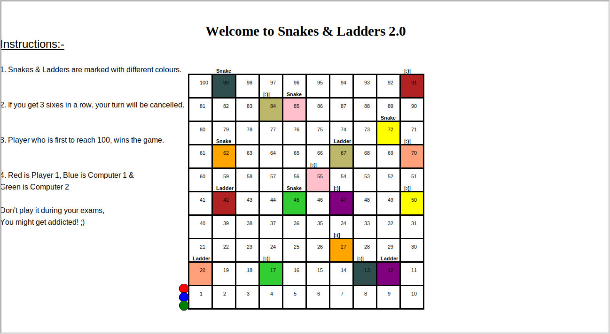

# Snakes & Ladders

[](https://www.python.org/) [](https://github.com/algomaster99/)

A simple game of snakes and ladders created on `Python 2.7` as a school project.

# Installation

### Dependencies

- `Python 2.7`
- [Turtle Library](https://docs.python.org/2/library/turtle.html)

### Setup

1. Install `Python 2.7`

```
$ cd /usr/src
$ sudo wget https://www.python.org/ftp/python/2.7.15/Python-2.7.15.tgz
$ sudo tar xzf Python-2.7.15.tgz
```

2. Install Turtle package

```
$ sudo apt-get install python-tk
```

3. Run it

```
$ python game.py
```

# Rules

1. After running the game, the board will be rendered in a few seconds.


2. Instructions are written to the left of the board.

3. Press <kbd>Enter</kbd> to roll the dice.

4. Press <kbd>Q</kbd> to chicken out. :chicken:
